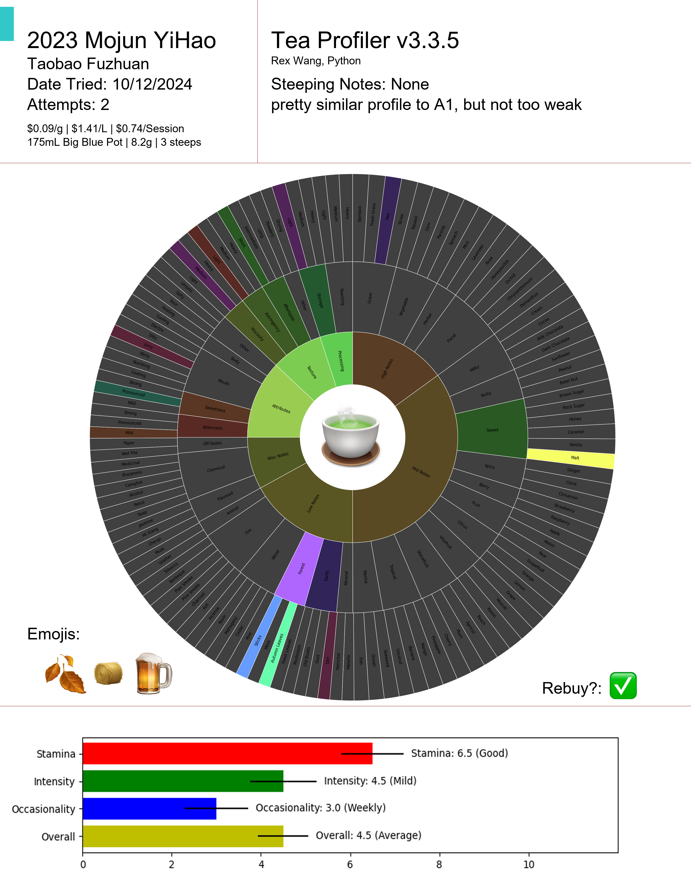

# tea-reviews
Personal tea review scripts for generating graphs. Excludes actual reviews

Not really intended for public use, but feel free to use it if you want. I'm not responsible for any issues that may arise from using this code.

Feel free to ask me questions about the code or how to use it. I'm happy to help.

Version: 3.3.5


## Usage
1. Clone the repository
2. Install the required packages
3. Place text review in the variable in `reviewparser.py`. Supply additional information if needed.
4. Run `reviewparser.py` to generate the graphs. It will automatically pull the parsed reviews from most recent parsed review.

## Modifications
- `reviewparser.py` is the marshalls and parses text reviews into a json. You can modify or make a new script that does the same thing. Attributes are traits that have 6 levels of intensity. Flavors are traits that have 2 levels of intensity. Intensity is represented on the graph by the brightness of the color. Attributes will instead pick one of three tiles to represent the intensity, with two colors each.
- `teaprofiler.py` is the script that generates the graphs. Categories and positions on the graph are hardcoded, so you may need to modify it to fit your needs.
- `helpers.py` define vendors, tea types, their associated colors, and other helper functions.

## Examples

Current Review Format

```
10/12/2024 TB 2023 Mojun YiHao Fuzhuan
Params: 8.2
Water, Vessel: 99c 90tds zerowater mix, bamboo charcoal, 175mL Big Blue Pot
Time: 240, 600, 1800, (end)
Notes: pronounced autumn leaves, pronounced forest, pronounced sticks, hay, juicy, sweet, pronounced malt, earth, dirt
Attributes: light bitterness, moderate sweetness, light storage, light astringency, light aftertaste, medium-thin viscosity
GraphScores: StaminaScore: 6.5, IntensityScore: 4.5, OccasionalityScore: 3, Rebuy: True, Attempts: 2, OverallScore: 4.5, Cost: 0.09, Emojis: [fallen_leaf.png|hay.png|beer.png]
Steeping Notes:
Remark: pretty similar profile to A1, but not too weak
```

Current Data generated from review
```
{
    "date": "10/12/2024",
    "vendorShort": "TB",
    "vendorLong": "Taobao",
    "title": "Mojun YiHao",
    "year": "2023",
    "type": "Fuzhuan",
    "params": "8.2",
    "waterVessel": "175mL Big Blue Pot",
    "waterVesselVolume": "175",
    "steepCount": 3,
    "flavorNotes": {
        "autumn leaves": -2,
        "forest": -2,
        "sticks": -2,
        "hay": -1,
        "juicy": -1,
        "sweet": -1,
        "malt": -2,
        "earth": -1,
        "dirt": -1
    },
    "attributeNotes": {
        "bitter": 1,
        "sweetness": 3,
        "storage": 1,
        "astringency": 1,
        "aftertaste": 1,
        "viscosity": 3
    },
    "steepNotes": "",
    "remark": "pretty similar profile to A1, but not too weak",
    "StaminaScore": 6.5,
    "IntensityScore": 4.5,
    "OccasionalityScore": 3.0,
    "Rebuy": true,
    "Attempts": 2,
    "OverallScore": 4.5,
    "CostPerGram": 0.09,
    "emojis": [
        "fallen_leaf.png",
        "hay.png",
        "beer.png"
    ],
    "RawReview": "10/12/2024 TB 2023 Mojun YiHao Fuzhuan\nParams: 8.2\nWater, Vessel: 99c 90tds zerowater mix, bamboo charcoal, 175mL Big Blue Pot\nTime: 240, 600, 1800, (end)\nNotes: pronounced autumn leaves, pronounced forest, pronounced sticks, hay, juicy, sweet, pronounced malt, earth, dirt\nAttributes: light bitterness, moderate sweetness, light storage, light astringency, light aftertaste, medium-thin viscosity\nGraphScores: StaminaScore: 6.5, IntensityScore: 4.5, OccasionalityScore: 3, Rebuy: True, Attempts: 2, OverallScore: 4.5, Cost: 0.09, Emojis: [fallen_leaf.png|hay.png|beer.png]\nSteeping Notes:\nRemark: pretty similar profile to A1, but not too weak"
}
```

Graph generated
